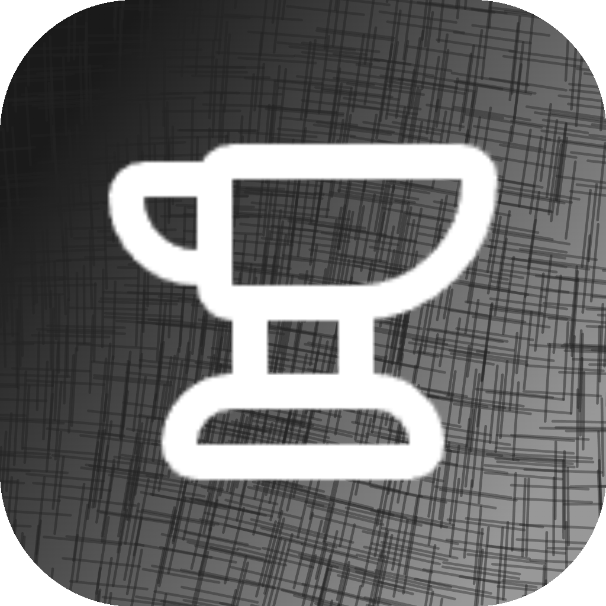

<div align="center">

<h1>&nbsp;Forge</h1>

### AI-Powered Development Team Orchestrator

**Transform a single Claude Code CLI into a full virtual development team.**

[](https://claude.ai)
[](LICENSE)
[](#-the-team)
[](#-skill-system)

[English](README.md) | [繁體中文](README.zh-TW.md)

---

*From a single sentence of requirement to a fully delivered product —*
*Forge handles the planning, delegation, quality assurance, and delivery automatically.*

</div>

---

## What is Forge?

Forge is an **orchestration framework** that runs on top of [Claude Code CLI](https://docs.anthropic.com/en/docs/claude-code). It turns a single AI assistant into a coordinated development team with specialized roles — a Product Manager, an Architect, Frontend/Backend Engineers, a QA Reviewer, and a DevOps Engineer — all working together under one Orchestrator.

Think of it as a **virtual software company** living inside your `.claude/` directory:

```
You (the CEO)
 └─ Forge Orchestrator (the Factory Manager)
     ├─ PM Agent           → analyzes requirements, writes specs
     ├─ Architect Agent    → designs systems, makes tech decisions
     ├─ Frontend Dev Agent → builds UI with React/Next.js/Tailwind
     ├─ Backend Dev Agent  → implements APIs, database, server logic
     ├─ QA Reviewer Agent  → validates every deliverable
     └─ DevOps Agent       → handles deployment, CI/CD, Docker
```

### Why Forge?

| Problem | Forge's Solution |
|---------|-----------------|
| AI loses context between conversations | Persistent project state — resume from exactly where you left off |
| AI writes code without understanding requirements | PM Agent clarifies needs first; Architect designs before coding |
| No quality gate on AI-generated code | Every task passes QA (build, lint, type-check, functional review) |
| Single AI tries to do everything | Specialized agents with domain knowledge and isolated contexts |
| Knowledge doesn't accumulate | Skills evolve over time; lessons from past projects improve future ones |

---

## Usage

### Prerequisites

- [Claude Code CLI](https://docs.anthropic.com/en/docs/claude-code) installed and configured
- Node.js 18+ (for project builds)
- Git

### Quick Start

**1. Clone the repository**

```bash
git clone https://github.com/your-username/forge.git
cd forge
```

**2. Launch Claude Code**

```bash
claude
```

Forge loads automatically via `.claude/CLAUDE.md` — no extra setup needed.

**3. Start your first project**

```
/start
```

Then describe your requirement in natural language:

```
I want to build a personal blog with Next.js.
It should have a markdown-based post system,
dark mode support, and an RSS feed.
```

Forge will:
1. Route your request to the PM Agent for requirement analysis
2. Generate a structured spec and task breakdown
3. Dispatch tasks to the appropriate agents
4. Run QA on every deliverable
5. Commit passing code automatically

**4. Check progress anytime**

```
/status
```

**5. Resume across sessions**

Just open Claude Code in the same directory. Forge reads the saved state and picks up where it left off.

### Slash Commands

| Command | Description |
|---------|-------------|
| `/start` | Launch a new requirement — enters the intake workflow |
| `/status` | View current project progress and task overview |
| `/plan` | View or modify the project spec |
| `/review` | Trigger a full QA audit on all pending tasks |
| `/retro` | Run a retrospective — analyze lessons and update skills |
| `/switch` | Switch between active projects |

---

## Architecture

### Dual-Layer Design

Forge separates **system-level concerns** (agents, skills, protocols) from **project-level data** (specs, tasks, code). This keeps projects self-contained and portable.

```
┌─────────────────────────────────────────────────────────────┐
│                    .claude/ (System Layer)                   │
│                                                             │
│   agents/          6 specialized AI team members            │
│   skills/          10+ reusable knowledge packages          │
│   orchestra/       protocols, templates, routing rules       │
│   state/           cross-session memory & preferences        │
│   CLAUDE.md        single entry point (auto-loaded)          │
└─────────────────────────────────────────────────────────────┘
                              │
                    ┌─────────┴─────────┐
                    ▼                   ▼
┌──────────────────────┐  ┌──────────────────────┐
│  projects/blog/      │  │  projects/api/       │
│                      │  │                      │
│  README.md           │  │  README.md           │
│  project.json        │  │  project.json        │
│  spec/current.md     │  │  spec/current.md     │
│  tasks/TASK-001.md   │  │  tasks/TASK-001.md   │
│  reviews/            │  │  reviews/            │
│  sessions/           │  │  sessions/           │
│  src/                │  │  src/                │
└──────────────────────┘  └──────────────────────┘
```

### The Forge Loop

The core execution engine that drives every project:

```
                    ┌──────────────┐
                    │  Scan Tasks  │ ◄─────────────────────┐
                    └──────┬───────┘                       │
                           │                               │
                    ┌──────▼───────┐                       │
                    │ Pick Highest │                       │
                    │ Priority Task│                       │
                    └──────┬───────┘                       │
                           │                               │
                    ┌──────▼───────┐                       │
                    │ Match Agent  │                       │
                    │ (semantic)   │                       │
                    └──────┬───────┘                       │
                           │                               │
                    ┌──────▼───────┐     ┌────────────┐   │
                    │  Dispatch    │────►│ Escalation │   │
                    │  via Task    │     │ Handler    │   │
                    └──────┬───────┘     └────────────┘   │
                           │                               │
                    ┌──────▼───────┐                       │
                    │  QA Review   │                       │
                    │  (build,     │                       │
                    │   lint,      │                       │
                    │   types,     │                       │
                    │   function)  │                       │
                    └──────┬───────┘                       │
                           │                               │
                    ┌──────▼───────┐    ┌──────────────┐  │
                    │    Pass?     │─NO─► Re-dispatch   │──┘
                    └──────┬───────┘    │ (max 3x)     │
                           │YES        └──────────────┘
                    ┌──────▼───────┐
                    │ Commit +     │
                    │ Update State │
                    └──────┬───────┘
                           │
                    ┌──────▼───────┐
                    │ Next Task /  │
                    │ Deliver      │
                    └──────────────┘
```

### Workflow Routing

Forge automatically classifies your input and routes it to the right workflow:

| Input Type | Scale | Route |
|-----------|-------|-------|
| Any task | Micro (≤3 files, clear goal) | **Route E** — Direct execution, skip PM |
| New feature | Small (single module) | **Route A** — Simplified planning |
| New feature | Medium/Large (multi-module) | **Route A** — Full planning with Architect |
| Bug fix | Any | **Route A** or **Route E** |
| Continue work | Any | **Route B** — Resume from saved state |
| Clarification needed | Any | **Route C** — PM handles Q&A |
| QA failures pending | Any | **Route D** — Fix and re-review |

---

## The Team

### Agent Roles

<table>
<tr>
<td align="center" width="150">

**🎯 PM**

Product Manager

</td>
<td>

Analyzes requirements, communicates with users, writes structured specs (OpenSpec format), breaks work into tasks. Asks clarifying questions when requirements are < 80% complete.

</td>
</tr>
<tr>
<td align="center">

**🏗️ Architect**

System Architect

</td>
<td>

Makes technology choices, designs system architecture, writes ADRs (Architecture Decision Records). Activated for medium/large projects or when other agents escalate.

</td>
</tr>
<tr>
<td align="center">

**🎨 Frontend Dev**

Frontend Engineer

</td>
<td>

Builds UI components, page layouts, responsive design. Specializes in React, Next.js (App Router), and Tailwind CSS.

</td>
</tr>
<tr>
<td align="center">

**⚙️ Backend Dev**

Backend Engineer

</td>
<td>

Implements API endpoints, database schemas, server logic. Works with Node.js, Next.js API Routes, and database operations.

</td>
</tr>
<tr>
<td align="center">

**✅ QA Reviewer**

Quality Assurance

</td>
<td>

Validates every deliverable: runs `npm run build`, `npm run lint`, `npx tsc --noEmit`, checks functional completeness, and reviews code quality.

</td>
</tr>
<tr>
<td align="center">

**🚀 DevOps**

DevOps Engineer

</td>
<td>

Handles deployment configs, CI/CD pipelines, Docker containers, environment management, and git branch operations.

</td>
</tr>
</table>

### Escalation Protocol

Agents can request help from other agents without blocking their work:

```
Agent hits a problem beyond their expertise
        │
        ▼
Returns ##ESCALATION marker to Orchestrator
        │
        ├─ blocking: true  → Current task paused, target agent dispatched
        │
        └─ blocking: false → Noted for later, current task continues
```

---

## Skill System

Skills are reusable knowledge packages injected into agent contexts. They evolve over time as the team accumulates experience.

### Domain Skills

| Skill | Description | Used By |
|-------|-------------|---------|
| `code-style` | Naming conventions, formatting rules, import ordering | All dev agents |
| `api-conventions` | RESTful patterns, error formats, pagination strategies | PM, Architect, Backend |
| `react-patterns` | Next.js App Router, component patterns, state management | Frontend Dev |
| `testing-standards` | Test strategies, coverage targets, naming conventions | QA Reviewer, dev agents |

### How Skills Evolve

```
1st occurrence of a pattern  →  Noted in QA review
2nd occurrence               →  Added to skill's references/lessons.md
3rd+ occurrence              →  Promoted to core skill definition
```

---

## Project Lifecycle

```
 ┌──────┐    ┌──────────┐    ┌──────────┐    ┌───────────┐    ┌───────────┐
 │Intake│───►│ Planning │───►│  Coding  │───►│ Reviewing │───►│ Delivery  │
 │      │    │          │    │          │    │           │    │           │
 │ /start│    │ PM+Arch  │    │ Dev team │    │ QA loops  │    │ Git tag   │
 │ talk  │    │ write    │    │ builds   │    │ until     │    │ Retro     │
 │ to PM │    │ spec +   │    │ features │    │ all pass  │    │ Cleanup   │
 │      │    │ tasks    │    │          │    │           │    │           │
 └──────┘    └──────────┘    └──────────┘    └───────────┘    └───────────┘
```

Each project is fully self-contained in `projects/{name}/` with:

| File/Dir | Purpose |
|----------|---------|
| `project.json` | State machine — status, progress, tech stack, session history |
| `spec/current.md` | Living requirements document (OpenSpec format) |
| `tasks/TASK-*.md` | Individual work units with acceptance criteria |
| `reviews/` | QA reports for each task |
| `sessions/` | Conversation logs for continuity |
| `src/` | The actual deliverables (code, assets, configs) |

---

## Safety & Guardrails

Forge includes multiple safety mechanisms:

| Mechanism | Limit | Behavior |
|-----------|-------|----------|
| Total loop iterations | 50 | Save progress → report → pause |
| QA retries per task | 3 | Mark task as blocked |
| Consecutive failures | 3 | Emergency pause → await user input |

The Orchestrator **never** writes code directly. It delegates, reviews, and coordinates — ensuring every piece of code goes through proper QA before being committed.

---

## Configuration

### User Preferences

Edit `.claude/state/preferences.yaml` to customize:

```yaml
tech_stack:
  frontend: "Next.js 16 (App Router)"
  styling: "Tailwind CSS"
  language: "TypeScript (strict mode)"
  backend: "Node.js / Next.js API Routes"
  database: "SQLite (small) | PostgreSQL (medium/large)"

code_style:
  indent: 2
  quotes: single
  semicolons: false
  max_line_width: 100

communication:
  language: "繁體中文"
  style: "direct and concise"
```

### Adding Custom Agents

Create a new `.md` file in `.claude/agents/` following the template at `.claude/orchestra/templates/agent-template.md`. The Orchestrator will automatically discover and route tasks to it based on the `description` field.

---

## Design Principles

| Principle | Description |
|-----------|-------------|
| **Orchestrator Pattern** | Single coordinator, parallel specialized agents |
| **Zero Context Loss** | Full state persistence — resume from any breakpoint |
| **Quality Gate** | Every delivery must pass QA; failures loop back with diagnostics |
| **Self-Contained Projects** | Portable, handoff-ready, readable by humans and AI |
| **Cumulative Learning** | Skills, preferences, and patterns improve over time |
| **Scale Adaptive** | Same framework for 5-minute fixes and multi-month projects |
| **Semantic Routing** | Task descriptions auto-match to the best agent |

---

## License

MIT
